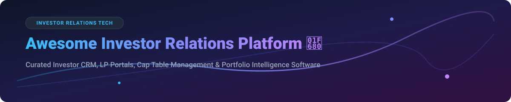

  

# 🚀 Awesome Investor Relations Platform

> **Curated List of SaaS Products & Open-Source GitHub Projects Focused on Investor CRM, Fundraising Pipeline, LP Reporting & Portfolio Management**

  
  
  
  
  

---

Welcome to the ultimate **Investor Relations Platform** directory! This repository tracks top enterprise SaaS platforms and self-hosted open-source tools for venture capital firms, private equity funds, family offices, and startup founders. Whether you are managing investor communications, tracking fundraising pipelines, maintaining cap tables, generating LP reports, or monitoring portfolio performance, this guide helps you choose the right stack.

---

## 📑 Table of Contents
- [📊 Market Overview & Industry Analysis](#-market-overview--industry-analysis)
- [💼 Top SaaS & Hosted Investor Relations Platforms](#-top-saas--hosted-investor-relations-platforms)
- [🔓 Open-Source & Self-Hosted Solutions](#-open-source--self-hosted-solutions)
- [🤝 How to Contribute](#-how-to-contribute)
- [☕ Support & Sponsorship](#-support--sponsorship)
- [📈 Star History](#-star-history)
- [⚠️ Disclaimer](#%EF%B8%8F-disclaimer)

---

## 📊 Market Overview & Industry Analysis

> 💡 **Market Size & Structure:** The global Investor Relations (IR) and Private Capital Management software market is estimated at **$4.8 Billion** and is projected to reach **$9.2 Billion by 2030** (CAGR ~9.8%). 
> 
> The market is **moderately fragmented**: institutional cap table management and enterprise PE fund administration display strong network effects dominated by category leaders (e.g., Carta, Enterprise DealCloud), while founder-focused fundraising CRMs, portfolio KPI trackers, and AI-native LP updates remain open and competitive for disruptive SaaS startups and transparent open-source solutions.

---

## 💼 Top SaaS & Hosted Investor Relations Platforms

Below is a comparison of top-tier hosted platforms for venture capital, private equity, and startup investor management, ranked by estimated company size (valuation/annual revenue).

| Platform | Category / Focus | Key Features | Pricing Tier (Starting Rate) | Free Tier / Trial Details | Est. Company Size (Valuation / Revenue) |
| :--- | :--- | :--- | :--- | :--- | :--- |
| **[Carta](https://carta.com)** 📈 | Equity & Cap Table Management | Cap table management, 409A valuations, fund administration, investor portal, scenario modeling | Custom quotes (~$3,000 - $15,000+/yr for paid tiers) | **Carta Launch Plan**: Free forever for early startups (<25 stakeholders, <$1M raised) | **$7.4B Valuation** (~$500M Revenue) |
| **[Juniper Square](https://www.junipersquare.com)** 🏢 | Private Markets & Real Estate IR | Enterprise investor CRM, automated LP portals, capital calls, fund accounting & reporting | Quote-based enterprise pricing (est. starting ~$18,000/yr) | No free tier or trial (Product demo available) | **$1.1B Valuation** (~$139.8M Revenue) |
| **[Affinity](https://www.affinity.co)** 🤝 | Relationship Intelligence CRM | Automated email/calendar deal mapping, relationship strength scoring, warm introduction tracking | Starts at ~$2,000 - $2,400 per user/year (billed annually) | No free trial (Sales demo upon request) | **$550M Valuation** (~$50M Revenue) |
| **[DealCloud](https://www.dealcloud.com)** 🏛️ | Financial CRM & PE Deal Management | Institutional deal sourcing, LP relationship management, due diligence tracking, pipeline analytics | Enterprise custom contracts (est. starting ~$30,000+/yr) | No free tier or trial (Product demo required) | **Division of Intapp ($3.8B Market Cap)** (~$57M Unit Revenue) |
| **[Backstop Solutions](https://www.backstopsolutions.com)** 📊 | Institutional IR & Asset Management | Portfolio monitoring, LP capital accounting, institutional CRM, compliance tracking | Quote-based enterprise pricing | No free tier or trial (Interactive demo available) | **$150M Est. Valuation** (~$30.5M Revenue) |
| **[Ledgy](https://www.ledgy.com)** 💶 | European Startup Equity & Cap Tables | Cap table automation, phantom stock/ESOP plans, investor reporting, 409A/IFI valuations | Paid tiers start at ~€5,000/year | **Launch Plan**: Free tier for early startups (up to 50 stakeholders) | **$100M Est. Valuation** (~$9.8M Revenue) |
| **[Visible.vc](https://visible.vc)** 📬 | Founder-Investor Updates & VC Monitoring | Monthly KPI update newsletters, investor pipeline CRM, pitch deck analytics, LP reporting | Paid plans start at ~$99/month | **Free Starter Account** (Basic updates) + 14-Day Free Trial on paid plans | **$19M Valuation** (~$7.2M Revenue) |
| **[Vestberry](https://www.vestberry.com)** 🤖 | AI Portfolio Monitoring & LP Reporting | Automated LP report creation, portfolio KPI data collection, AI-powered IRR & MOIC analytics | Custom subscription model based on fund size | **14-Day Free Trial** available upon request | **$15M Est. Valuation** (~$3.5M Revenue) |
| **[Foundersuite](https://foundersuite.com)** 🛠️ | Startup Fundraising & Investor CRM | Investor CRM database, investor update sender, virtual data room (VDR), pitch deck tracker | Paid plans start at ~$89/month (with annual discount) | **Basic Plan**: Free forever (up to 25 investors in CRM, unlimited updates) | **$13M Series A Funded** (~$650K Revenue) |

---

## 🔓 Open-Source & Self-Hosted Solutions

Open-source IR tools provide complete data privacy, customizability, and full control over sensitive financial records without per-seat licensing fees.

*    **[Krayin CRM](https://github.com/krayin/laravel-crm)** 🛠️ — Enterprise-grade open-source Laravel CRM providing complete lead management, custom entities, and workflow automation. Highly adaptable for tracking LP relationships and fundraising pipelines. (MIT License)
*    **[EspoCRM](https://github.com/espocrm/espocrm)** 📊 — Flexible open-source CRM application that allows customization of entity types, relationship mappings, and automated workflows for private equity deal flows and investor contact management. (AGPL-3.0)
*    **[Captable](https://github.com/open-cap/captable)** 📑 — Open-source equity management system built with TypeScript. Serves as a transparent alternative to Carta and Pulley for managing shareholder registries, SAFEs, and convertible notes.
*    **[Creme CRM](https://github.com/creme-crm/creme_crm)** 🐍 — Highly customizable Python/Django CRM framework tailored for complex entity-relationship structures, ideal for fund management firms needing bespoke investor tracking logic.
*    **[Malak](https://github.com/Malak-IR/malak)** ✉️ — Self-hosted investor relations platform built for founders. Features monthly update dispatches, KPI dashboards, virtual data rooms (VDR), and fundraising pipeline CRM with audit logs. (AGPL-3.0)
*    **[Hemrock Fund Accounting](https://github.com/hemrock/fund-accounting)** 🧮 — Open-source fund accounting and portfolio reporting software. Includes plain-text accounting for venture funds/SPVs, LP capital account statements, and an integrated MCP server for AI queries.
*    **[DenchClaw](https://github.com/denchclaw/denchclaw)** 🔒 — Local-first, open-source AI CRM powered by DuckDB for private equity firms. Tracks deal origination, NDA/CIM due diligence workflows, portfolio company metrics, and advisor networks locally.
*    **[Alignmink Investor CRM](https://github.com/alignmink/alignmink-crm)** 🧠 — Local-first, LLM-powered fundraising CRM for founders. Parses pitch deck context, drafts outreach emails via local/OpenRouter keys, and tracks 7-stage pipelines without external telemetry. (Apache-2.0)
*    **[InvestorPortaLPro](https://github.com/investorportalpro/investorportalpro)** 🌐 — Open-source investment software featuring CRM, fundraising tools, virtual data rooms (VDR), dynamic investor reporting, and integrations with institutional accounting systems like Investran and Geneva.
*    **[Sapling CRM](https://github.com/sapling-crm/sapling)** ⚡ — Open-source CRM infrastructure featuring a built-in Model Context Protocol (MCP) server for AI assistants, role-based access control, dynamic dashboard templates, and Docker deployment (PostgreSQL + pgvector).
*    **[Lightweight VC/PE Investment Management System](https://github.com/vcinvestment/vcsystem)** 🏮 — Open-source operations management system for venture capital and private equity firms. Covers project pipelines, fund LP management, portfolio monitoring, and researcher tracking (PHP + MySQL).

---

## 🤝 How to Contribute

Contributions are warmly welcomed! Help make this the most complete resource for investor relations platforms:

1. **Fork** this repository.
2. **Add or update** entries in `README.md` following the standard table/list format.
3. Ensure added projects include accurate links, descriptions, and factual details.
4. Submit a **Pull Request** with a clear explanation of your changes.

---

## ☕ Support & Sponsorship

If you find this curated list valuable for your startup or fund, please consider supporting the project!

- ⭐️ **Star** this repository on GitHub to increase its visibility.
- 🔄 **Share** it with fellow founders, VCs, and PE professionals.
- 💖 **Sponsor**: Buy me a coffee or sponsor ongoing maintenance on GitHub Sponsors:

---

## 📈 Star History

---

## ⚠️ Disclaimer

This repository is a community-curated list intended for informational and educational purposes only. It does not constitute financial, legal, or investment advice. Always perform thorough due diligence and verify regulatory compliance before adopting investor relations or cap table software.
